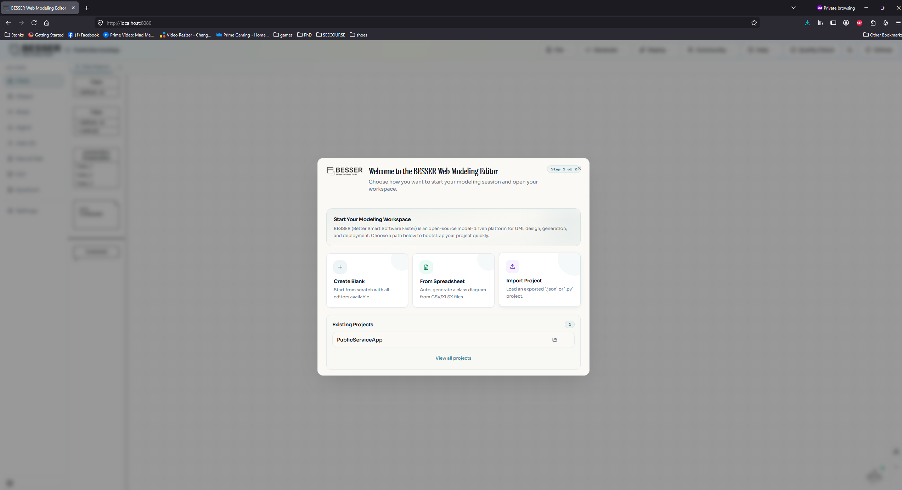

# Who Are My Users? — Replication Package

This repository is the replication package accompanying the paper **"Who Are My
Users?: A graphical language and modeling
environment to specify your end-user profiles"**. It bundles the three components needed to start the tool and reproduce the demonstration, together with a single Docker Compose setup
that builds and runs all of them.

> **About the copies.** The three component directories in this repository are
> **snapshots** taken at the time of paper submission, included here so the tool
> can be reproduced exactly as it was demonstrated. They are frozen copies — the
> actively maintained, up-to-date projects live in their own upstream
> repositories:
>
> - Backend / B-UML → <https://github.com/BESSER-PEARL/BESSER>
> - Web Modeling Editor (frontend) → <https://github.com/BESSER-PEARL/BESSER-Web-Modeling-Editor>
> - Modeling agent → <https://github.com/BESSER-PEARL/modeling-agent>

| Component | Directory | Role | Port |
|-----------|-----------|------|------|
| **Backend** | [`BESSER/`](./BESSER) | BESSER FastAPI backend — UML ↔ B-UML conversion, code generation, validation | `9000` |
| **Modeling agent** | [`modeling-agent/`](./modeling-agent) | Conversational LLM agent that drives the modeling assistant over a WebSocket | `8765` |
| **Frontend** | [`BESSER-Web-Modeling-Editor-new/`](./BESSER-Web-Modeling-Editor-new) | BESSER Web Modeling Editor (Vite build served by Express) | `8080` |

```
                        browser (http://localhost:8080)
                                     │
              ┌──────────────────────┼───────────────────────┐
              │ HTTP :9000/besser_api │ WebSocket :8765        │ static assets :8080
              ▼                       ▼                        ▼
        ┌───────────┐          ┌──────────────┐          ┌───────────┐
        │  backend  │          │ modeling-agent│         │ frontend  │
        │ (FastAPI) │          │  (WebSocket)  │          │ (Express) │
        └───────────┘          └──────────────┘          └───────────┘
              └────────── OPENAI_API_KEY ──────────┘
```

The browser talks to all three services directly on `localhost`, so the URLs
are compiled into the frontend bundle at build time and point at the published
host ports.

---

## Prerequisites

- **Docker** and **Docker Compose v2** (`docker compose`, not the legacy
  `docker-compose`). Tested with Docker 28.x.
- An **OpenAI API key** — required by both the backend and the modeling agent.
  Get one at <https://platform.openai.com/api-keys>.
- ~8 GB free disk (the modeling agent image pulls the BESSER agentic framework
  with its ML dependencies).

## Setup

1. Copy the environment template and add your OpenAI key:

   ```bash
   cp .env.example .env
   # then edit .env and set OPENAI_API_KEY=sk-...
   ```

   Docker Compose reads this `.env` automatically. The same key is injected into
   both the backend and the modeling-agent containers.

2. Build and start everything:

   ```bash
   docker compose up --build
   ```

   The first build takes several minutes (Node build for the frontend, ML
   dependencies for the agent). Subsequent runs are cached.

3. Open the editor at **<http://localhost:8080>**.

To run in the background use `docker compose up --build -d`, and follow logs with
`docker compose logs -f`.

## Example projects

Two exported projects are included in [`example_models/`](./example_models) so
you can inspect the models used in the demonstration without recreating the
entire workflow from scratch:

- [`baseProject.json`](./example_models/baseProject.json) is the starting
  project. It contains the base public-service application, the example
  user-profile model, and the base agent model, but does not contain the
  personalized variants.
- [`personalizedProject.json`](./example_models/personalizedProject.json) is
  the project after the personalized variants have been generated. It lets you
  inspect the resulting personalized GUI and agent models directly.

To open either project, use the **Import Project** option in the welcome dialog
of the editor and select the corresponding `.json` file. The import option is
shown below:



The demonstration workflow uses the conversational modeling assistant to create
the user-profile model, then uses that profile to personalize the GUI and agent
models. If you do not have an OpenAI API key, you can still import and inspect
`personalizedProject.json`; only the LLM-powered modeling and personalization
steps require an API key.

## Stopping / cleaning up

```bash
docker compose down            # stop and remove containers
docker compose down --rmi local -v   # also remove built images and volumes
```

## Ports

| Service | URL |
|---------|-----|
| Frontend (editor UI) | http://localhost:8080 |
| Backend API | http://localhost:9000/besser_api |
| Modeling agent (WebSocket) | ws://localhost:8765 |

If any of these ports is already in use on your machine, either free it or edit
the `ports:` mappings in `docker-compose.yml`. If you remap the backend or agent
port, also update the matching `BACKEND_URL` / `UML_BOT_WS_URL` in `.env` so the
frontend bundle is rebuilt against the new address (`docker compose build
frontend`).

## Configuration reference

All configuration lives in the root `.env` (see [`.env.example`](./.env.example)):

| Variable | Required | Default | Used by |
|----------|----------|---------|---------|
| `OPENAI_API_KEY` | **yes** | — | backend, modeling-agent |
| `DEPLOYMENT_URL` | no | `http://localhost:8080` | frontend (build arg) |
| `BACKEND_URL` | no | `http://localhost:9000/besser_api` | frontend (build arg) |
| `UML_BOT_WS_URL` | no | `ws://localhost:8765` | frontend (build arg) |
| `CORS_ORIGINS` | no | `http://localhost:8080,http://localhost:5173,http://localhost:3000` | backend |

## Troubleshooting

- **`Set OPENAI_API_KEY in .env`** on `docker compose up` — you have not created
  `.env` or left the key blank. Copy `.env.example` to `.env` and set the key.
- **Assistant panel cannot connect / WebSocket errors** — check the agent is
  healthy (`docker compose logs modeling-agent`). It needs a valid
  `OPENAI_API_KEY` to start responding.
- **Frontend shows but code generation fails** — check
  `docker compose logs backend`; CORS or key issues are logged there.
- **Changed a URL in `.env` but the frontend still uses the old one** — the URLs
  are baked in at build time. Rebuild the frontend:
  `docker compose build frontend && docker compose up -d frontend`.
- **`ReadTimeoutError` while downloading Python packages (e.g. TensorFlow)** — on slower or unstable internet connections, `pip` may time out while downloading large dependencies during the initial image build. Simply rerun the build, as it often succeeds on a second attempt:

  ```bash
  docker compose up --build
  ```

  If the problem persists, check your network connection or try again later, as the issue is usually caused by a temporary timeout while downloading packages from PyPI.
  

## Building behind a corporate proxy

On a normal network `docker compose up --build` works out of the box. If your
organisation uses a TLS-intercepting proxy (Zscaler, Netskope, etc.), the build
containers won't trust the injected root CA and `pip` / `npm` will fail with
`CERTIFICATE_VERIFY_FAILED`. To fix it locally without changing the package,
drop a `docker-compose.override.yml` next to this file that builds from
CA-aware Dockerfiles which `COPY` your corporate root CA and set
`PIP_CERT` / `REQUESTS_CA_BUNDLE` (Python images) and `NODE_EXTRA_CA_CERTS`
(Node image). Such override files are git-ignored.

## Security note

The OpenAI key is a secret. `.env` is git-ignored — do **not** commit it. If you
previously exposed a key in any committed file, rotate it at
<https://platform.openai.com/api-keys>.

## Component documentation

Each component keeps its own upstream README and license. The links below point
to the frozen local copy and to the live upstream repository:

- Backend / B-UML: [`BESSER/README.md`](./BESSER/README.md) — upstream: <https://github.com/BESSER-PEARL/BESSER>
- Web Modeling Editor: [`BESSER-Web-Modeling-Editor-new/README.md`](./BESSER-Web-Modeling-Editor-new/README.md) — upstream: <https://github.com/BESSER-PEARL/BESSER-Web-Modeling-Editor>
- Modeling agent: [`modeling-agent/README.md`](./modeling-agent/README.md) — upstream: <https://github.com/BESSER-PEARL/modeling-agent>
